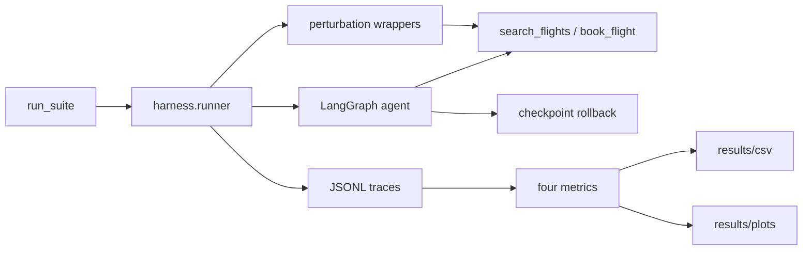

# Agent Reliability Harness — Project Plan

Working copy of the scaffold plan. Source of truth for what we build this pass vs stretch. Inspired by [Towards a Science of AI Agent Reliability](https://arxiv.org/abs/2602.16666) (Rabanser et al., 2026).

**The product is a harness for real LLM agents** (OpenAI + LangGraph + tools). A fake LLM exists only so we can assemble folders, logging, and metrics without burning API calls. Same graph, tools, perturbations, and scores either way — never a second “mock-only” agent.

**This pass:** end-to-end pipeline with **four core metrics**. Extra paper metrics and τ-bench are **stretch**.

---

## Build checklist

- [x] Folders, `__init__.py`, `.gitignore`, `.env.example`, `requirements.txt`, `results/` gitkeeps
- [ ] Mock tools, LangGraph, OpenAI + mock LLM, flight-booking YAML, post-run “how sure are you 0–1?” node
- [ ] Template paraphrases; latency / partial-failure wrappers
- [ ] Checkpoint/rollback after successful search; retry `book_flight` from snapshot
- [ ] Config, asyncio trial runner, JSONL/CSV logging, `TrialResult`
- [ ] Four core metrics + CSV/plot; stub stretch metric functions
- [ ] `experiments/run_suite.py` defaults to OpenAI; `--mock` only for plumbing; README
- [ ] **STRETCH:** trajectory + resource consistency; split fault/prompt/latency robustness; early-trace failure AUROC
- [ ] **STRETCH:** plug in τ-bench behind the same tool/task interface; keep in-memory catalog as default

---

## Plain-language steps (what we actually build)

1. **Folders and plumbing** — Empty Python packages, `requirements.txt`, README, a place for logs/CSVs/plots.
2. **A small booking agent (real LLM is the point)** — One task: “book this flight.” Two **mock airline tools** (fake catalog, not a fake brain). LangGraph: think → tool → think. The brain is OpenAI. A fake LLM is optional (`--mock`) only while wiring pieces.
3. **Make the world messy on purpose** — Reword the instruction, delay the tools, or make a tool return empty/error.
4. **Checkpoint / rollback** — After a good search, save the results. If booking fails, rewind and retry booking. Compare with vs without this net **on the real agent**.
5. **Trial runner** — Repeat many times, log traces (reliability data comes from real-model variance, not from the fake LLM).
6. **Four core scores** — consistency, robustness, paper-style “how sure are you?” (Brier), cascade severity.
7. **Commands** — `python -m experiments.run_suite --mock --k 2` = plumbing. `python -m experiments.run_suite` with `OPENAI_API_KEY` = the actual experiment.

---

## What is the same vs different from the paper

**Same idea**

- Reliability is more than “did it pass once.”
- Four pillars: consistency, robustness, predictability, bounded harm.
- Repeat each task K times at temperature 0.
- Perturb prompts and inject tool faults (`p_fault = 0.2` like the paper).
- Core outcome consistency and robustness formulas match Table 2 (`C_out`, `Acc_pert / Acc_0`).

**Different in this pass**

- **Only 4 scores shipped as headlines.** Trajectory, resource, split robustness, and early-trace forecasting are stretch.
- **Predictability** follows the paper: post-run self-confidence. Headline number is Brier (`R_Pred = P_brier`); calibration and AUROC are computed in the same pass because they use the same `confidence` field.
- **Bounded severity** is cascade harm, not paper safety/compliance.
- **Latency** is a perturbation (and part of the robustness drop), not a named paper metric yet.
- Checkpoint/rollback is extra vs the paper.
- Toy LangGraph + in-memory airline tools **this pass**, not GAIA / τ-bench yet. The **LLM is real**; the **tools** are simulated so we control ground truth and faults. τ-bench is stretch.

---

## Real LLM vs fake LLM

| | Real OpenAI (default) | Fake LLM (`--mock`) |
| --- | --- | --- |
| Purpose | Measure agent reliability | Check that runner → logs → metrics → plots wire up |
| When | Any experiment you would cite | Building a folder, a wrapper, or a CSV writer |
| Variance | Real (even at temperature 0) | Near-deterministic happy path |

Design rules:

- One agent graph. The LLM is a **swappable chat model**, not a fork of the agent.
- Mock **tools** (flight catalog) stay in both modes so success is checkable and faults are injectable.
- Do not tune prompts or checkpoints around the fake LLM. If a metric is meaningless on the mock (e.g. consistency ≈ 1.0), that is expected; report it as a wiring check, not a result.
- Default `run_suite` **requires** `OPENAI_API_KEY` and fails clearly if missing. `--mock` is explicit and documented as “not a reliability result.”

---

## Layout

```
agent/           LangGraph agent, state, mock booking tools, LLM factory
perturbation/    paraphrase templates, latency + partial-failure wrappers
harness/         config, trial runner, structured logging
metrics/         consistency, robustness, predictability, severity, report
mitigation/      checkpoint/rollback
experiments/     run_suite.py
tasks/           YAML task specs (one flight-booking task)
results/         logs/, csv/, plots/  (gitkeep only)
PLAN.md          this file
```

Also: `requirements.txt`, `.env.example`, `.gitignore`, `README.md`. Flat packages at repo root (not `src/`).

---

## Pipeline



Each **trial** is one (task, condition, repeat_index) run. Conditions: `baseline`, `paraphrase`, `latency`, `tool_failure`, each with `mitigation` on/off. Full matrix later: **1 task × 3 repeats × 4 conditions × 2 mitigation flags = 24 trials**, asyncio-bounded concurrency (default 2). First real OpenAI run is smaller (k=2, baseline only).

---

## Agent: 3-step flight booking

**Task** in `tasks/flight_booking.yaml`: book SFO→JFK on a fixed date for a named passenger, morning, under $400.

**Two mock tools** in `agent/tools.py`, behind a small backend interface (`search`, `book`, `is_success`) so a later τ-bench adapter can replace the in-memory catalog without rewriting the runner:

- `search_flights(origin, destination, date)` — in-memory catalog: **one gold** (morning, under $400) and **at least one distractor** (wrong time or over budget) so a real model can fail by booking the wrong flight.
- `book_flight(flight_id, passenger_name)` — confirmation if `flight_id` exists in the catalog (gold or distractor).

**Success**: booked the gold `flight_id`. **Wrong booking** is a high-severity failure (not just `success=False`).

**LangGraph** (`agent/graph.py`, `agent/state.py`): ReAct-style loop (`agent` ↔ `tools`) then a **confidence node** (paper Appendix F.3.4 style): “On a scale from 0 to 1, how confident are you that you completed the booking correctly? Reply with a single number.” Parse into `state["confidence"]` (regex for a 0–1 float; default `0.5` if unparseable). Cap steps (e.g. 8). Mock LLM: `0.9` if last `book_flight` succeeded, else `0.25`.

**LLM factory** (`agent/llm.py`):

- **Default:** `ChatOpenAI` (`gpt-4o-mini`, `temperature=0` like the paper). Requires `OPENAI_API_KEY`.
- **`--mock` only:** deterministic chat model (search → book gold → confidence 0.9/0.25). Same tool schema and confidence parse path.

Checkpoint mitigation is a graph/tool-layer concern: after a successful search, snapshot `{flights, last_search_args}` into state; on `book_flight` failure, restore that snapshot and retry booking (retry budget 1–2). Implemented in `mitigation/checkpoint.py` when `mitigation=checkpoint`.

---

## Perturbations

`perturbation/paraphrase.py`: **template paraphrases** of the task instruction (no extra LLM call in the skeleton). 3–5 semantically equivalent wordings.

`perturbation/wrappers.py`: tool wrappers (applied at trial start):

- **Latency**: `asyncio.sleep` before returning (configurable, default ~0.5–1.5s).
- **Partial failure**: with probability `p_fault=0.2` (paper default), return timeout / empty list / malformed payload on that call.

Wrappers record events onto the trial trace (`tool_name`, `latency_ms`, `fault_injected`, `ok`).

---

## Harness

`harness/config.py`: pydantic-settings from env + CLI (`k`, `concurrency` default 2, `model`, `mock`, `p_fault`, `seed`). Paired mitigation runs reuse `hash(task, condition, repeat)` as the fault RNG seed.

`harness/runner.py`: `asyncio.Semaphore` concurrent trials; each trial builds a fresh graph. `TrialResult`: `task_id`, `condition`, `repeat`, `success`, `severity`, `confidence`, `actions`, `latency_ms`, `tool_calls`, `trace_path`.

`harness/logging.py`: one JSONL file per suite under `results/logs/` plus a flattened CSV of trial rows.

---

## Metrics — this pass (4 core)

All scores in `[0, 1]`, higher = more reliable. Log raw fields (actions, latency, tool errors) so stretch metrics can be added later.

1. **Consistency** — outcome only: `C_out = (1/T) Σ (2 p̂_t − 1)²` on baseline identical repeats.
2. **Robustness** — one score: mean of `min(Acc_pert / Acc_0, 1)` across paraphrase, latency, and fault (also print the raw pass-rate drop). If baseline accuracy is 0, skip the ratio (`n/a`).
3. **Predictability (paper)** — after the run, elicit `confidence` `c ∈ [0, 1]`. Headline: `P_brier = 1 − (1/N) Σ (c_i − y_i)²`. Also compute calibration (1 − ECE) and `P_AUROC` in the same function. If all runs succeed or all fail, AUROC is `n/a`.
4. **Bounded severity** — cascade weights (`search_miss=0.25`, `retry_storm=0.5`, `wrong_booking=1.0`); `S = 1 − E[w | failure]`.

`metrics/report.py`: those four + pass rates → CSV and a bar chart (with vs without mitigation).

---

## Stretch (after the pipeline works)

- **Consistency:** trajectory mix (JSD), trajectory order (Levenshtein), resource CV.
- **Robustness:** report `R_fault`, `R_prompt`, `R_latency` as separate rows.
- **Predictability:** early-trace failure AUROC (first tool failed / empty search).
- **Environment:** [τ-bench](https://github.com/sierra-research/tau-bench) — paper’s simulated airline/retail DB. Swap in as a task/tool backend; keep the same trial runner. Default remains the tiny catalog until this is wired.
- Still later: environment-robustness perturbations, paper safety/compliance, live travel APIs.

Do **not** over-build the τ-bench plugin this pass. A tiny Protocol (`search`, `book`, `is_success`) is enough.

---

## Experiment entrypoint

`python -m experiments.run_suite`:

1. Load tasks + config
2. Run trial matrix (**OpenAI by default**; `--mock` opt-in)
3. Write logs/CSV
4. Compute metrics
5. Print a short reliability table (baseline vs mitigation) and plot paths

Primary command: `python -m experiments.run_suite --k 3` (needs API key).  
Plumbing: `python -m experiments.run_suite --mock --k 2`.

---

## Dependencies

`requirements.txt`: `langgraph`, `langchain`, `langchain-openai`, `langchain-core`, `openai`, `pandas`, `numpy`, `matplotlib`, `pydantic`, `pydantic-settings`, `python-dotenv`, `pyyaml`, `scikit-learn` (AUROC only). Python 3.11+.

---

## Review (plan fixes, not stretch)

- **Make the catalog fail-able.** Gold + distractor flights so a real model can book the wrong id.
- **Paired faults for mitigation.** Same per-trial RNG seed with vs without checkpoint.
- **Guard metric edge cases.** Baseline acc 0 → skip robustness ratio. All-success or all-fail → AUROC `n/a`.
- **First real OpenAI run should be tiny.** 1 task × k=2 × baseline only, then perturbations.
- **Concurrency 2–3** against OpenAI.
- **Parse confidence from messy text**; default `0.5` if unparseable.
- **Latency may not drop pass rate.** Fault + paraphrase are the real robustness signals.
- **Checkpoint is only visible under `tool_failure`.** Baseline-with-checkpoint is a control.

---

## Build in small steps (verify each before the next)

1. Folders, `requirements.txt`, README, `.env.example`.
2. In-memory catalog + `search`/`book` + gold vs distractor — no LLM.
3. LangGraph + OpenAI + confidence node; `--mock` for a single happy-path run.
4. Latency + fault wrappers; logs show `fault_injected`.
5. Checkpoint/rollback, same seed paired.
6. Runner writes JSONL/CSV for a tiny mock matrix, then a tiny real baseline (k=2).
7. Four metrics + one plot; numbers sane or `n/a`.
8. Full `run_suite` (4 conditions × mitigation) only after 6–7 look right.

---

## Out of scope this pass

Stretch metrics, τ-bench plug-in, live airline APIs, Anthropic, ensemble/verification, environment robustness, paper safety/compliance, LLM-generated paraphrases. `--mock` must still complete search → book → confidence so harness code can be tested without a key.
